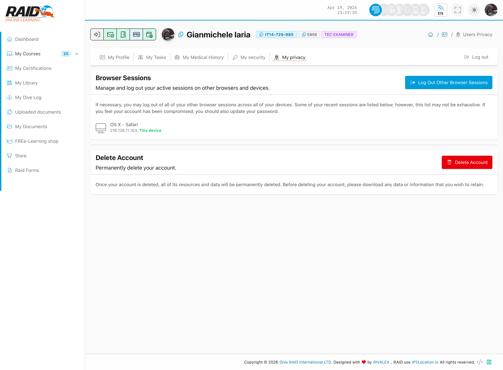

# خصوصيتي

## الغرض

إعدادات الخصوصية والموافقات.

## أين تجده

قائمة صورة الملف -> **خصوصيتي**



<details>
<summary>للدعم (تفاصيل تقنية)</summary>

```text
GET https://user.diveraid.com/ar/user/profile/privacy
```

</details>
