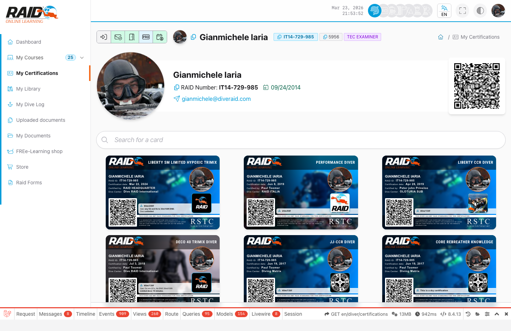

# Diver: certifications

## Where to find it

Menu: **Diver -> Certifications**

## Certifications list

Typical steps:

1. Open the certifications list.
2. Select a certification to view details.
3. If available, open history to review progress and results.



## Certification history

## Common issues

- Missing certification: it may not be associated with your profile yet.
- History link does not open: item not available or old link.

<details>
<summary>For support (technical details)</summary>

```text
GET /{locale}/diver/certifications
GET /{locale}/diver/certifications/history/{certification}
GET /{locale}/diver/certifications/history/{certification}/quiz/{quiz}
GET /{locale}/diver/certifications/history/{certification}/exam/{exam}
GET /{locale}/diver/certifications/history/{certification}/skills
```

</details>

Next: [Awards](awards.md)
