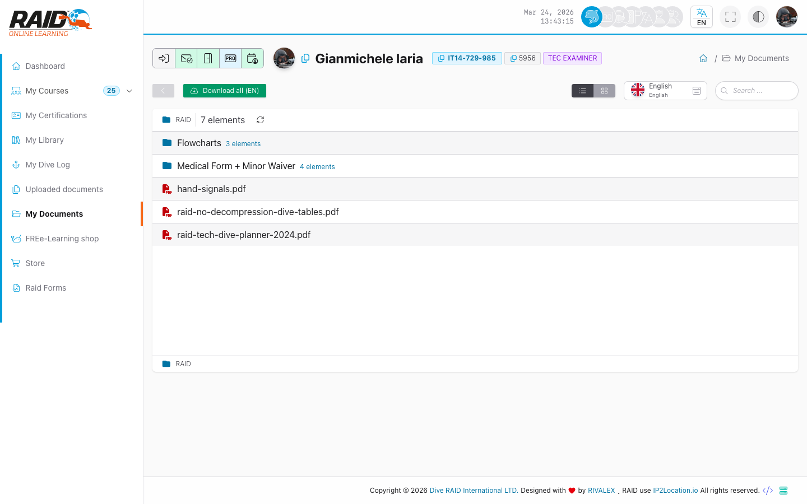

# Diver: documents

## Where to find it

Menu: **Diver -> My Documents**

## Personal documents

This is where you find documents provided to you.



Typical steps:

1. Open the list.
2. Select a document.
3. View or download (depending on the UI).

For documents you uploaded, go to [Uploaded documents](uploaded-documents.md).

## Common issues

- Document not visible: it may not be associated to your profile yet, or you may not have access.
- Download does not start: reload the page or check browser download/security settings.

<details>
<summary>For support (technical details)</summary>

```text
GET https://user.diveraid.com/en/diver/my-documents
```

</details>

Next: [Courses](courses.md)
