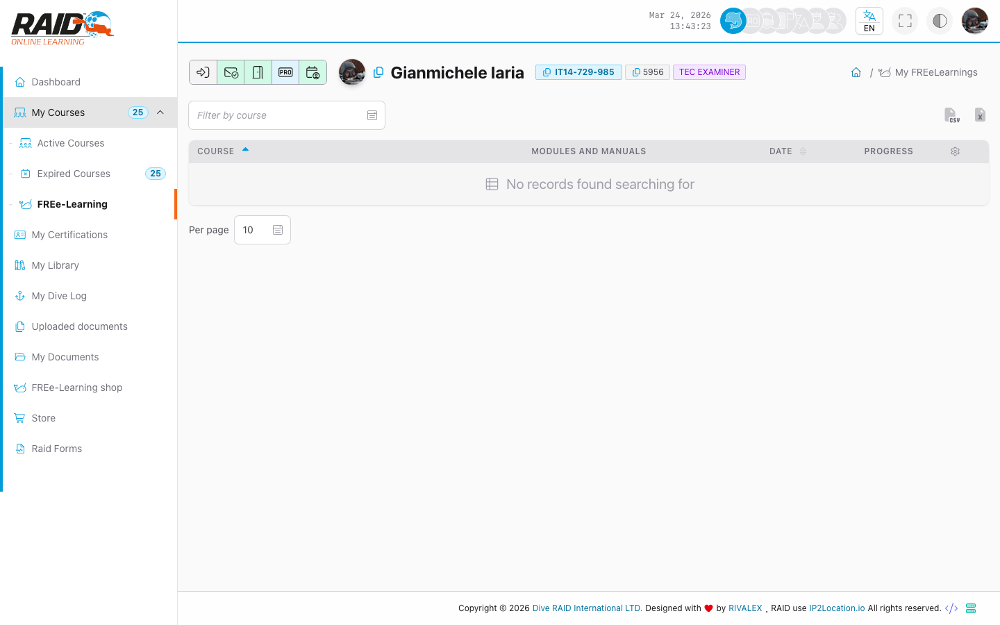

# Diver: free learnings

## What they are

Free learnings are training contents accessible via a simplified flow (typically without purchase).

## Where to find it

Menu: **Diver -> Free Learnings**

## Enroll

Typical steps:

1. Open the enroll page.
2. Select the content to activate (if required).
3. After enrolling, go back to the list to start.

## List

Typical steps:

1. Open the list.
2. Select a free learning to open progress.



## Progress
Open a free learning item to see its progress and continue where you left off.

## Common issues

- No content visible: you may not be enrolled yet (use the enroll page).
- Redirected to login: session expired.

<details>
<summary>For support (technical details)</summary>

```text
GET https://user.diveraid.com/en/diver/free-learnings/enroll
GET https://user.diveraid.com/en/diver/free-learnings
GET https://user.diveraid.com/en/diver/free-learnings/progress/{log_code}/
GET https://user.diveraid.com/en/diver/free-learnings/progress/{log_code}/module/{module}
GET https://user.diveraid.com/en/diver/free-learnings/progress/{log_code}/quiz/{quiz}
```

</details>

Next: [Certifications](certifications.md)
