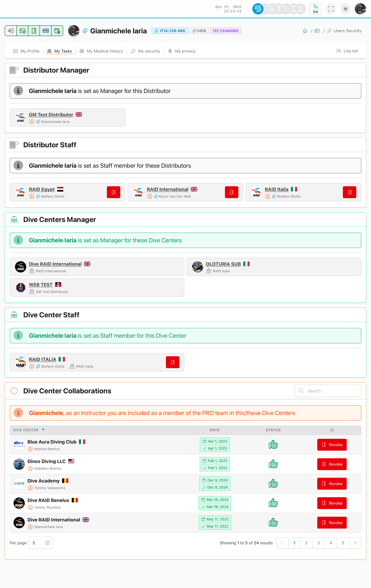

# My Tasks

## Purpose

Assignments and invitations linked to your account (when enabled).

## Where to find it

Profile photo menu -> **My Tasks**



## Typical actions

- Review pending invitations and active collaborations.
- Confirm or dismiss invitations.

<details>
<summary>For support (technical details)</summary>

```text
GET https://user.diveraid.com/en/user/profile/assignments
```

</details>

Next: [My Medical History](my-medical.md)
