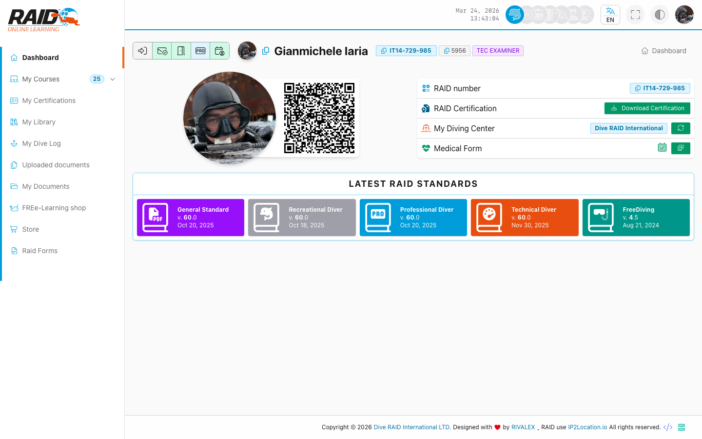
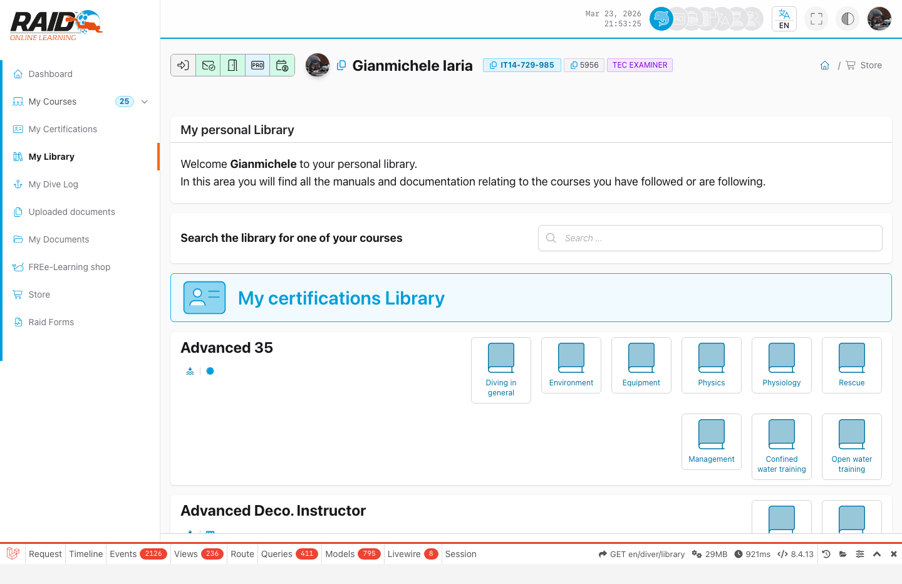
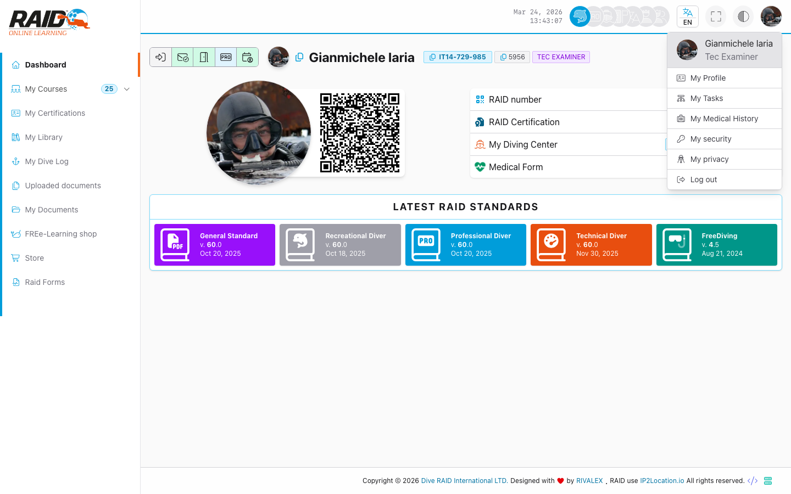

# Diver: dashboard

## Screenshot







## Objetivo

El dashboard es la pagina de entrada del area Diver y normalmente agrupa los enlaces principales (cursos, certificaciones, documentos, etc.).

## Donde encontrarlo

Menu: **Cuadro de mandos**

## Que hacer aqui (pasos tipicos)

1. Comprueba elementos destacados (cursos en curso, notificaciones, vencimientos).
2. Ve a **Courses** para continuar un recorrido.
3. Ve a **Certifications** para revisar tarjetas e historial.
4. Ve a **Dive Logs** para crear o actualizar tus logs.

## Barra superior (iconos junto a fecha/hora)

En la esquina superior derecha, junto a la fecha y la hora, tienes algunos accesos rapidos:

- **Iconos de perfil (Diver / PRO / Dive Center / Distributor):** permiten cambiar entre areas.
  Los iconos aparecen solo si tu cuenta tiene la cualificacion/rol correspondiente.
- **Al hacer clic:** se abre el dashboard del area seleccionada.
- **Idioma (EN/IT/DE/FR/ES/NL/ZH):** cambia el idioma de la interfaz.
- **Pantalla completa:** activa/desactiva el modo pantalla completa.
- **Tema/contraste:** cambia el aspecto (por ejemplo claro/oscuro).
- **Foto de perfil (cuenta):** abre el menu de la cuenta.

### Si hago clic en mi foto

Abre el menu de cuenta (como en la captura) con opciones como:

- **My Profile / Il mio profilo:** detalles de tu perfil.
- **My Activities:** resumen de tu actividad en el portal.
- **My Medical History:** informacion/formularios medicos (si esta habilitado).
- **My Security:** ajustes/consentimientos de seguridad (si esta disponible).
- **My Privacy:** ajustes de privacidad.
- **Sign out / Disconnetti:** cerrar sesion.

## Problemas comunes

- Te envia al login: sesion caducada o no autenticado.
- Acceso bloqueado/error: email no verificado.

## Notas

La pagina inicial de la aplicacion (`/`) redirige al login.

<details>
<summary>Para soporte (detalles tecnicos)</summary>

```text
GET https://user.diveraid.com/es/diver/dashboard
```

</details>

Siguiente: [Documents](documents.md)
