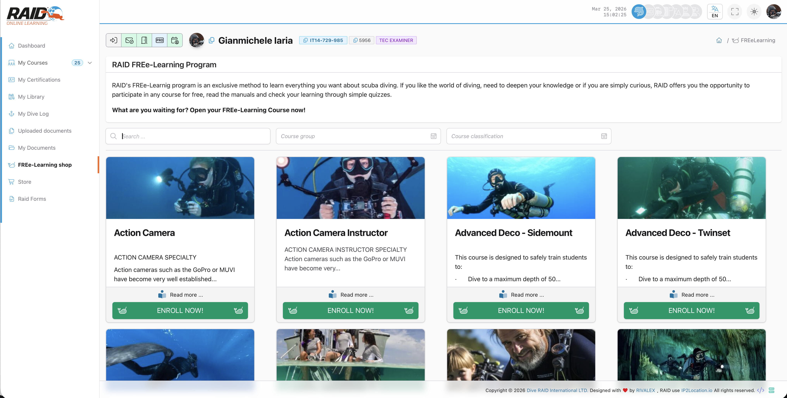

# Diver: free learnings

## Que son

Los free learnings son contenidos de formacion accesibles con un flujo simplificado (normalmente sin compra).

## Donde encontrarlo

Menu: **Tienda FREE-Learning**



## Enroll

Pasos tipicos:

1. Abre la pagina de enroll.
2. Selecciona el contenido para activar (si es necesario).
3. Despues, vuelve a la lista para empezar.

## Lista

Pasos tipicos:

1. Abre la lista.
2. Selecciona un free learning para ver el progreso.


## Progreso

Abre un elemento para ver el progreso y continuar donde lo dejaste.

## Problemas comunes

- No hay contenido: puede que no estes enrolled (usa la pagina enroll).
- Te envia al login: sesion caducada.

<details>
<summary>Para soporte (detalles tecnicos)</summary>

```text
GET https://user.diveraid.com/es/diver/free-learnings/enroll
GET https://user.diveraid.com/es/diver/free-learnings
GET https://user.diveraid.com/es/diver/free-learnings/progress/{log_code}/
GET https://user.diveraid.com/es/diver/free-learnings/progress/{log_code}/module/{module}
GET https://user.diveraid.com/es/diver/free-learnings/progress/{log_code}/quiz/{quiz}
```

</details>

Siguiente: [Certifications](certifications.md)
