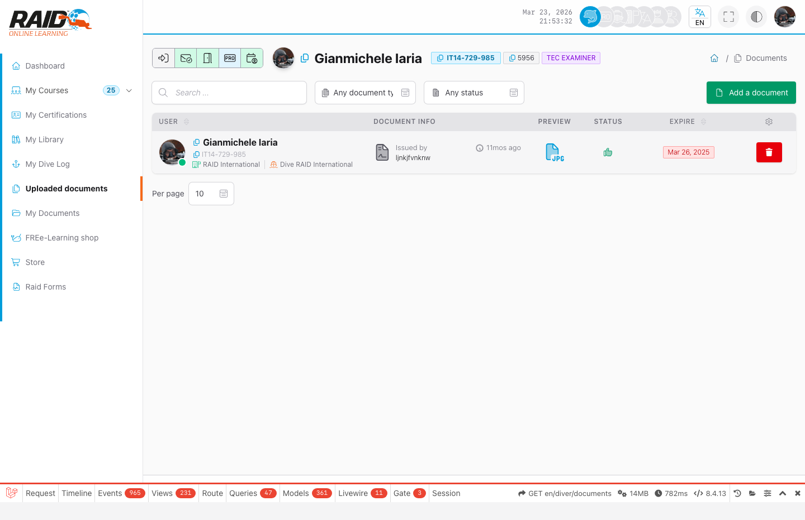

# Diver: documentos cargados

## Donde encontrarlo

Menu: **Documentos cargados**

## Documentos cargados

Aqui encuentras documentos asociados a tu perfil (normalmente subidos/registrados bajo tu cuenta).



Pasos tipicos:

1. Abre la lista.
2. Filtra o busca (si esta disponible).
3. Abre un documento para ver los detalles.

## Como cargar un documento

Pasos tipicos:

1. Haz clic en **Add a document**.
2. En **Document type**, elige el tipo (ver abajo).
3. Carga el archivo (PDF/JPG/PNG).
4. Completa los campos requeridos (segun el tipo).
5. Guarda y revisa el documento en la lista.

## Que tipo de documento debo cargar?

- **Documento general:** cualquier archivo general (varios/soporte).
- **Licencia (crossover):** certificaciones utiles para un crossover.
- **Certificado medico Diver:** certificado medico para el diver.
- **Certificado medico profesional (Divemaster/Instructor):** certificado medico para profesionales.
- **Seguro profesional:** comprobante de seguro profesional.

## Problemas comunes

- Documento no visible: puede que no este asociado a tu perfil o no tengas acceso.
- La descarga no empieza: recarga la pagina o revisa los ajustes de descargas/seguridad del navegador.

<details>
<summary>Para soporte (detalles tecnicos)</summary>

```text
GET https://user.diveraid.com/es/diver/documents
```

</details>

Siguiente: [Mis documentos](documents.md)
