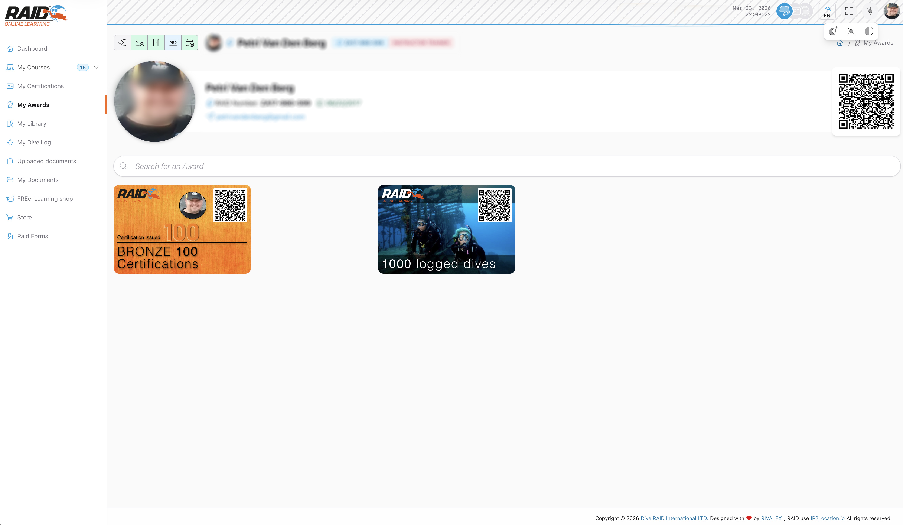

# Diver: awards

La page **Awards** contient tes cartes de reconnaissance et le flux de commande (si disponible pour ton compte).

## Ou le trouver

Menu : **Diver -> Awards**



## Types d'awards

Il existe deux types principaux :

**Diver (logged dives)**

- 100 logged dives
- 500 logged dives
- 1000 logged dives
- 5000 logged dives

**Professional (certifications issued)**

- Bronze : 100 certifications issued
- Silver : 500 certifications issued
- Gold : 1000 certifications issued
- Platinum : 5000 certifications issued

## Liste des awards

Etapes typiques :

1. Ouvrir la liste.
2. Selectionner une carte/un award.
3. Demarrer la commande.

## Comment obtenir un award

Quand tu atteins un nouveau palier (logged dives ou certifications issued), le systeme affiche generalement un message dans le dashboard
et te permet de commander la carte correspondante.

Etapes typiques :

1. (Optionnel) Utilise la recherche pour trouver un award.
2. Selectionne une carte/un award.
3. Demarre le flux de commande (si disponible pour ton compte).

Apres une commande reussie, la carte est emise et tu la retrouves dans **Awards**.

## Problemes frequents

- Resultat `fail` : reessaye ou verifie ta methode de paiement (si applicable).
- Award non disponible : il peut ne pas etre achetable pour ton profil ou ton pays.

<details>
<summary>Pour le support (details techniques)</summary>

```text
GET https://user.diveraid.com/fr/diver/awards
GET https://user.diveraid.com/fr/diver/awards/{card}/order
GET https://user.diveraid.com/fr/diver/awards/order/success
GET https://user.diveraid.com/fr/diver/awards/order/fail
```

</details>

Suivant : [Dive Logs](dive-logs.md)
