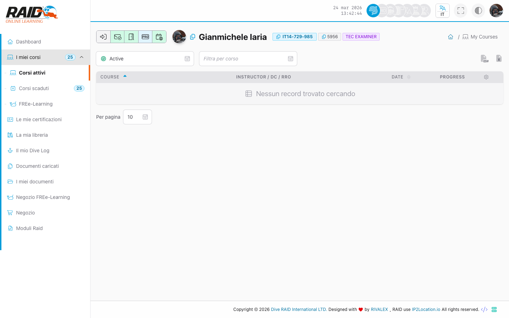
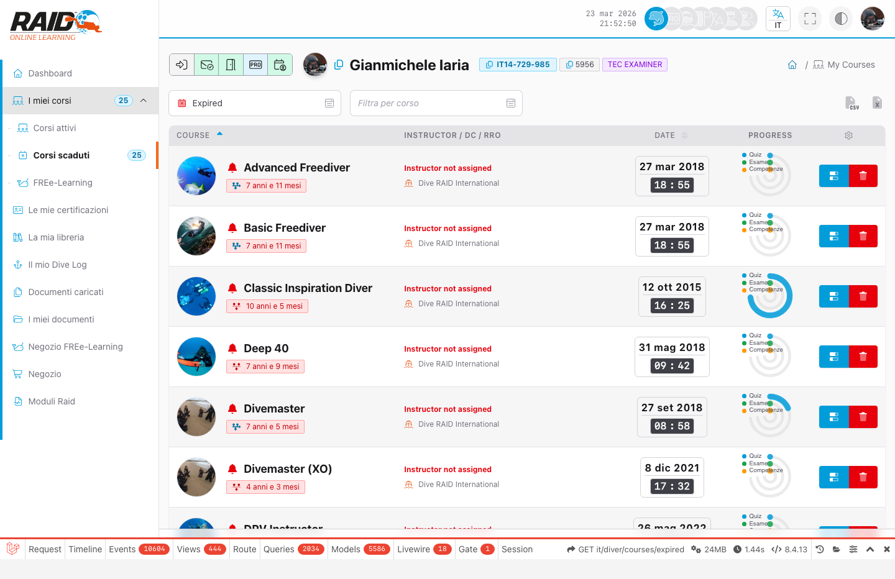

# Diver: corsi

## Screenshot





## Dove lo trovi

Menu: **Diver -> Courses**

## Cosa puoi fare

- Vedere i corsi attivi e quelli scaduti.
- Aprire il progress di un corso.
- Continuare moduli/quiz, esame e skills (se previsti dal corso).

## Elenco corsi

Passi tipici:

1. Apri la lista corsi.
2. Seleziona un corso per entrare nel suo progress.
3. Se un corso non compare, controlla la sezione dei corsi scaduti (se presente).

Passi tipici:

1. Dentro al corso, individua il prossimo step da completare (modulo, quiz, esame, skills).
2. Completa lo step e torna al riepilogo progress per vedere l'avanzamento.

## Tentativi (quiz/esame/skills)

Suggerimenti:

- Se apri un modulo e vedi una pagina vuota o un errore, potrebbe essere un modulo non disponibile per il tuo corso o gia' completato.

## Dettaglio progress (quiz/esame/skills)

## Problemi comuni

- Redirect al login: sessione scaduta.
- Accesso negato: email non verificata.
- Corso non trovato: link vecchio oppure corso non associato al tuo utente.

<details>
<summary>Per supporto (dettagli tecnici)</summary>

Lista corsi:

```text
GET https://user.diveraid.com/it/diver/courses
GET https://user.diveraid.com/it/diver/courses/expired
```

Progress e tentativi:

```text
GET https://user.diveraid.com/it/diver/courses/progress/{log_code}
GET https://user.diveraid.com/it/diver/courses/progress/{log_code}/module/{module}
GET https://user.diveraid.com/it/diver/courses/progress/{log_code}/exam
GET https://user.diveraid.com/it/diver/courses/progress/{log_code}/skills
GET https://user.diveraid.com/it/diver/courses/progress/{log_code}/quiz/{quiz}
GET https://user.diveraid.com/it/diver/courses/progress/{log_code}/exam/{exam}
GET https://user.diveraid.com/it/diver/courses/progress/{log_code}/skill
GET https://user.diveraid.com/it/diver/courses/progress/{log_code}/skill/sign
```

</details>

Prossimo: [Free learning](free-learnings.md)
