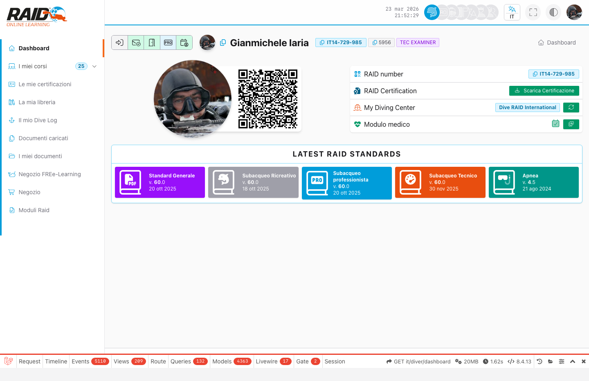
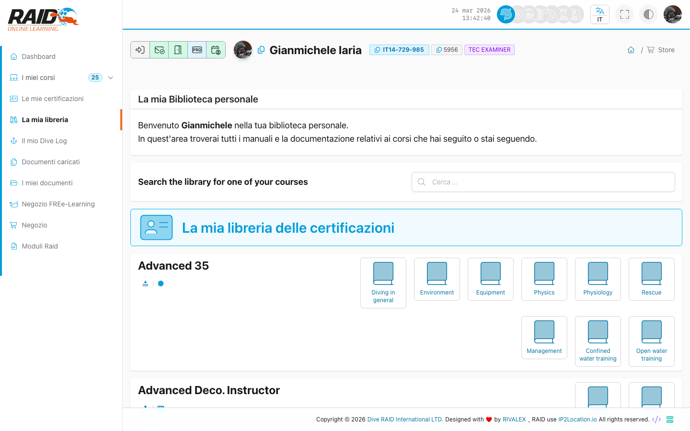

# Diver: dashboard

## Screenshot





## Scopo

La dashboard e' la pagina di ingresso dell'area Diver e aggrega i collegamenti principali (corsi, certificazioni, documenti, ecc.).

## Dove lo trovi

Menu: **Diver -> Dashboard**

## Cosa fare qui (passi tipici)

1. Controlla se ci sono elementi in evidenza (corsi in corso, notifiche, scadenze).
2. Entra in **Corsi** per continuare un percorso.
3. Entra in **Certificazioni** per consultare card e storico.
4. Entra in **Dive log** per creare o aggiornare i tuoi log.

## Problemi comuni

- Rimandi al login: sessione scaduta o non autenticato.
- Pagina bloccata/errore accesso: email non verificata.

## Note

La home applicativa (`/`) reindirizza al login.

<details>
<summary>Per supporto (dettagli tecnici)</summary>

```text
GET https://user.diveraid.com/it/diver/dashboard
```

</details>

Prossimo: [Documenti](documents.md)
