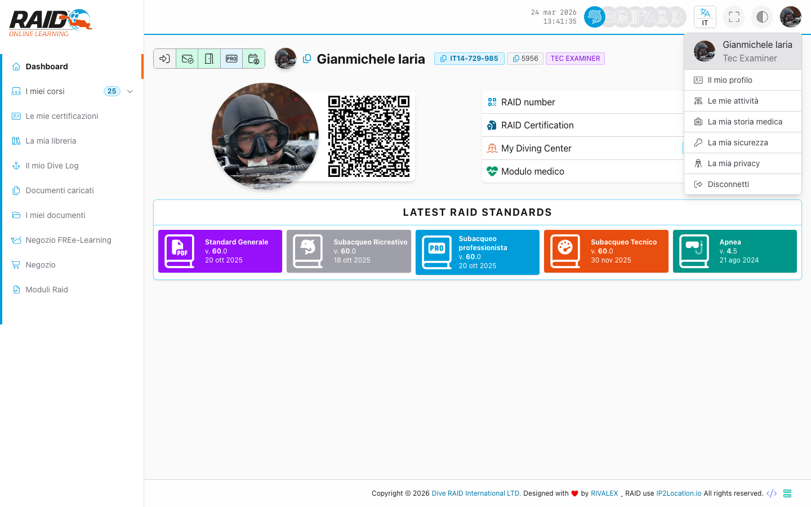

# Diver: dashboard

## Screenshot




## Scopo

La dashboard e' la pagina di ingresso dell'area Diver e aggrega i collegamenti principali (corsi, certificazioni, documenti, ecc.).

## Dove lo trovi

Menu: **Dashboard**

## Cosa fare qui (passi tipici)

1. Controlla se ci sono elementi in evidenza (corsi in corso, notifiche, scadenze).
2. Entra in **Corsi** per continuare un percorso.
3. Entra in **Certificazioni** per consultare card e storico.
4. Entra in **Dive log** per creare o aggiornare i tuoi log.

## Barra superiore (icone accanto a data/ora)

In alto a destra, accanto a data e ora, trovi alcune scorciatoie:

- **Icone profilo (Diver / PRO / Dive Center / Distributor):** servono per passare da un'area all'altra.
  Compaiono solo se il tuo utente ha la qualifica/ruolo corrispondente (es. se sei solo Diver vedrai solo l'icona Diver).
- **Cosa succede se clicchi:** vieni portato alla dashboard dell'area selezionata.
- **Lingua (IT/EN/DE/FR/ES/NL):** cambia la lingua dell'interfaccia.
- **Schermo intero:** passa a modalita' full screen (utile su tablet o in presentazione).
- **Tema/contrasto:** cambia aspetto dell'interfaccia (es. chiaro/scuro, a seconda della configurazione).
- **Foto profilo (account):** apre il menu del tuo account.

### Se clicco sulla mia foto

Si apre il menu account (come nello screenshot), con queste voci:

- **Il mio profilo:** dati del tuo profilo.
- **Le mie attivita':** riepilogo delle tue attivita' nel portale.
- **La mia storia medica:** sezione relativa ai dati/moduli medici (se abilitata per il tuo account).
- **La mia sicurezza:** impostazioni/consensi relativi alla sicurezza (se previsti).
- **La mia privacy:** impostazioni privacy.
- **Disconnetti:** esce dal portale (logout).

## Problemi comuni

- Rimandi al login: sessione scaduta o non autenticato.
- Pagina bloccata/errore accesso: email non verificata.

## Note

La home applicativa (`/`) reindirizza al login.

<details>
<summary>Per supporto (dettagli tecnici)</summary>

```text
GET https://user.diveraid.com/it/diver/dashboard
```

</details>

Prossimo: [Documenti](documents.md)
