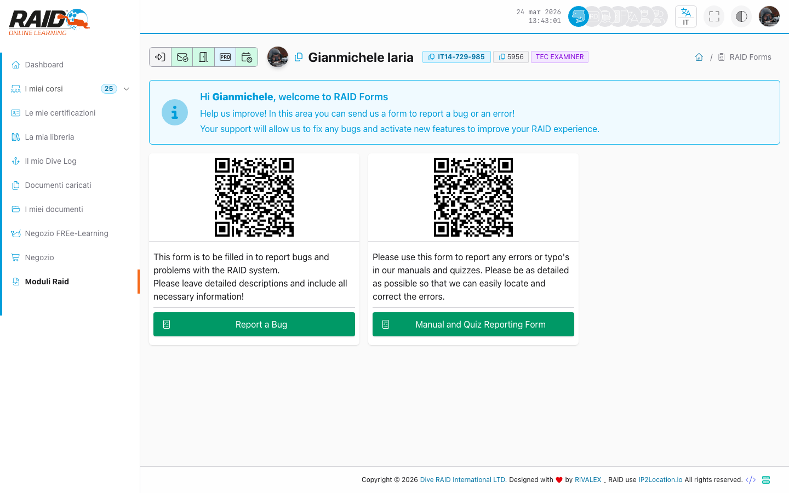

# Diver: moduli

## Dove lo trovi

Menu: **Diver -> Forms**

## Elenco moduli

Qui vedi l'elenco dei moduli disponibili.



Passi tipici:

1. Apri la lista moduli.
2. Seleziona un modulo per visualizzarlo o compilarlo (a seconda del tipo).

## Problemi comuni

- Modulo non disponibile: potrebbe essere riservato a un corso o a un ruolo specifico.

<details>
<summary>Per supporto (dettagli tecnici)</summary>

```text
GET https://user.diveraid.com/{locale}/diver/forms/
```

</details>
