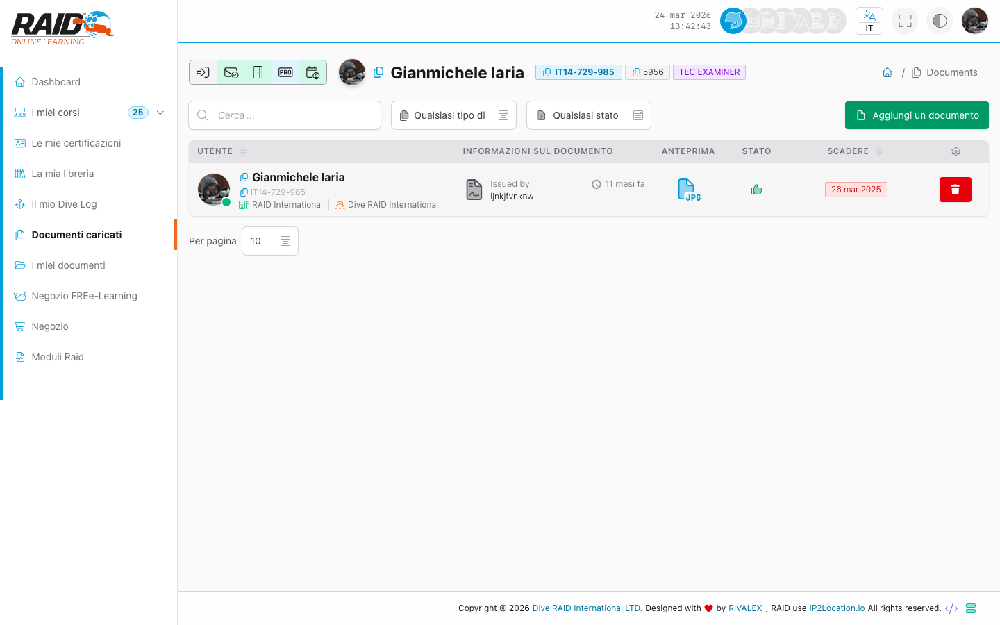

# Diver: documenti caricati

## Dove lo trovi

Menu: **Documenti caricati**

## Documenti caricati

Qui trovi i documenti associati al tuo profilo (tipicamente caricati/registrati a tuo nome).



Passi tipici:

1. Apri la lista.
2. Filtra o cerca (se disponibile).
3. Apri un documento per controllarne i dettagli.

## Come caricare un documento

Passi tipici:

1. Clicca **Add a document**.
2. In **Document type**, scegli il tipo (vedi sotto).
3. Carica il file (PDF/JPG/PNG).
4. Compila i campi richiesti (a seconda del tipo).
5. Salva e controlla il documento nella lista.

## Che tipo di documento devo caricare?

- **Documento generico:** qualsiasi file generico (documento di supporto/vario).
- **Licenza (crossover):** certificazioni utili per un crossover.
- **Certificato medico Diver:** certificato medico per il diver.
- **Certificato medico professionale (Divemaster/Istruttore):** certificato medico per i professionisti.
- **Assicurazione professionale:** documento di assicurazione professionale.

## Problemi comuni

- Documento non visibile: potrebbe non essere ancora stato associato al profilo o non hai permessi.
- Download non parte: prova a ricaricare la pagina o verifica che non ci siano blocchi del browser.

<details>
<summary>Per supporto (dettagli tecnici)</summary>

```text
GET https://user.diveraid.com/it/diver/documents
```

</details>

Prossimo: [I miei documenti](documents.md)
