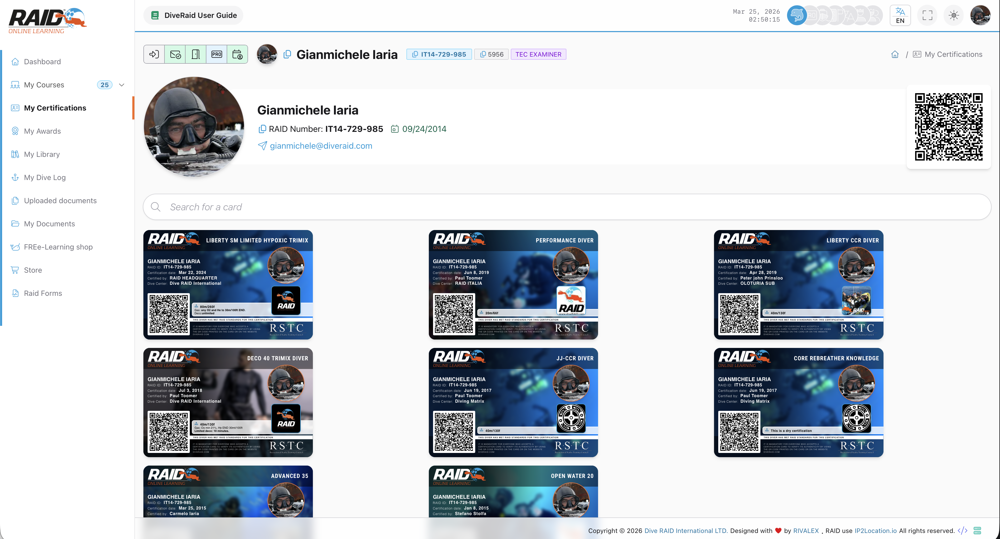
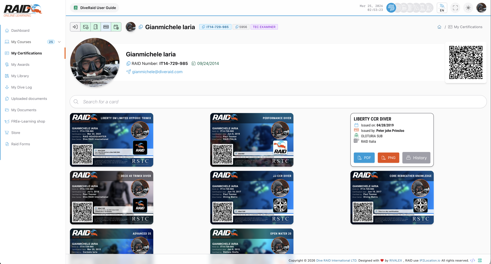
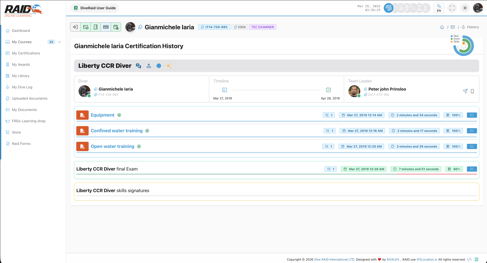

# 다이버: 내 인증

**내 인증** 페이지에서는 내 인증 카드들을 확인하고, PDF/PNG로 다운로드할 수 있습니다.

## 어디에서 찾을 수 있나요

메뉴: **다이버 -> 내 인증**



## 인증 목록

일반적인 단계:

1. 인증 목록을 엽니다.
2. 인증을 선택해 상세 내용을 확인합니다.
3. 인증 카드를 클릭하면 다른 쪽에 상세 정보가 표시됩니다(분할 보기).
4. 인증 카드를 **PDF** 또는 **PNG**로 다운로드합니다.
5. (가능한 경우) **History**를 열어 진행과 결과를 확인합니다.



## 인증 이력 (History)

이력(History) 페이지에서는 특정 인증의 진행 상세를 확인할 수 있습니다(코스 구성에 따라 모듈/퀴즈/시험/스킬 등).



## 자주 발생하는 문제

- 인증이 보이지 않음: 아직 내 프로필에 연결되지 않았을 수 있습니다.
- History 링크가 열리지 않음: 항목이 제공되지 않거나 오래된 링크일 수 있습니다.

<details>
<summary>기술 지원 (기술 정보)</summary>

```text
GET https://user.diveraid.com/ko/diver/certifications
GET https://user.diveraid.com/ko/diver/certifications/history/{certification}
GET https://user.diveraid.com/ko/diver/certifications/history/{certification}/quiz/{quiz}
GET https://user.diveraid.com/ko/diver/certifications/history/{certification}/exam/{exam}
GET https://user.diveraid.com/ko/diver/certifications/history/{certification}/skills
```

</details>

다음: [My Library](awards.md)
