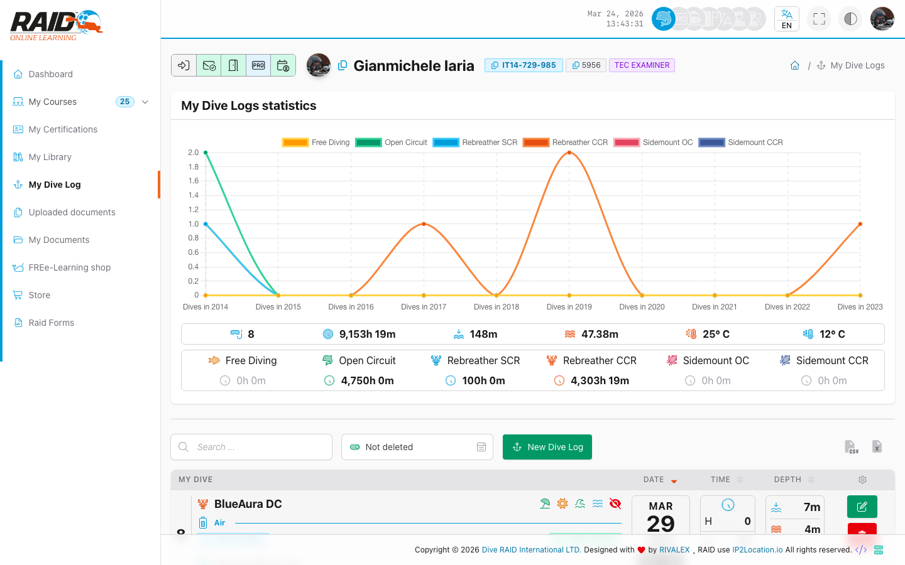

# 다이버: 내 다이빙 로그

## 어디에서 찾을 수 있나요

메뉴: **다이버 -> 내 다이빙 로그**

## 목록



## 생성

일반적인 단계:

1. **New**(새로 만들기)를 눌러 다이빙 로그를 생성합니다.
2. 필수 항목을 입력하고 저장합니다.
3. 특정 컨텍스트(예: skills)에서 진입한 경우, 일부 값이 미리 채워진 생성 플로우가 보일 수 있습니다.

## 보기 및 수정

## 자주 발생하는 문제

- 로그를 찾을 수 없음: 삭제되었거나 내 프로필에 연결되지 않았을 수 있습니다.
- 업데이트 오류: 잘못된 데이터이거나 권한이 부족할 수 있습니다.

<details>
<summary>기술 지원 (기술 정보)</summary>

```text
GET https://user.diveraid.com/ko/diver/dive_log
GET https://user.diveraid.com/ko/diver/dive_log/new
GET https://user.diveraid.com/ko/diver/dive_log/new_log/{skillLog?}/{skill?}
GET https://user.diveraid.com/ko/diver/dive_log/view/{diveLog}
GET https://user.diveraid.com/ko/diver/dive_log/update/{diveLog}
```

</details>

다음: [스토어](store.md)
