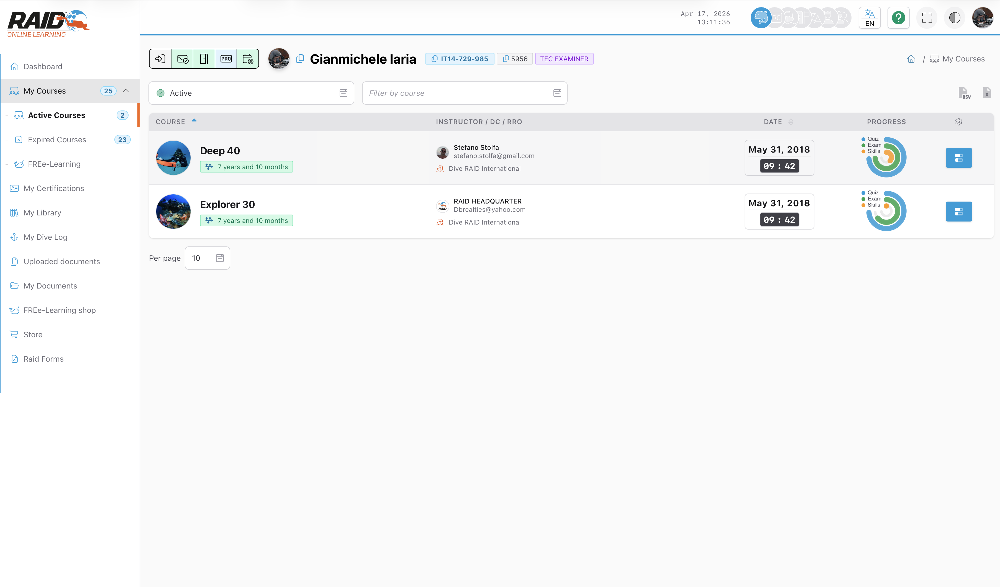
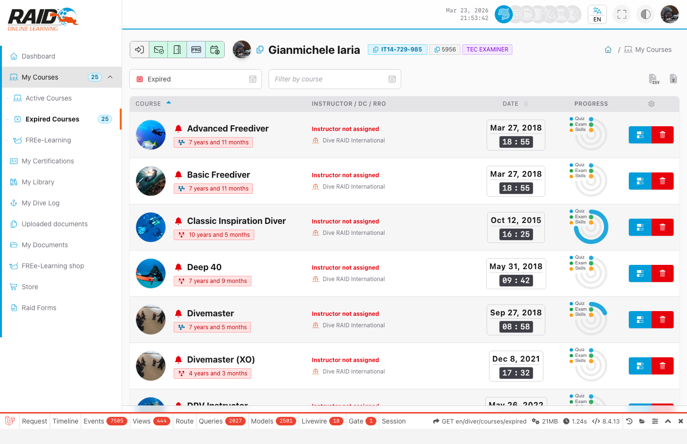
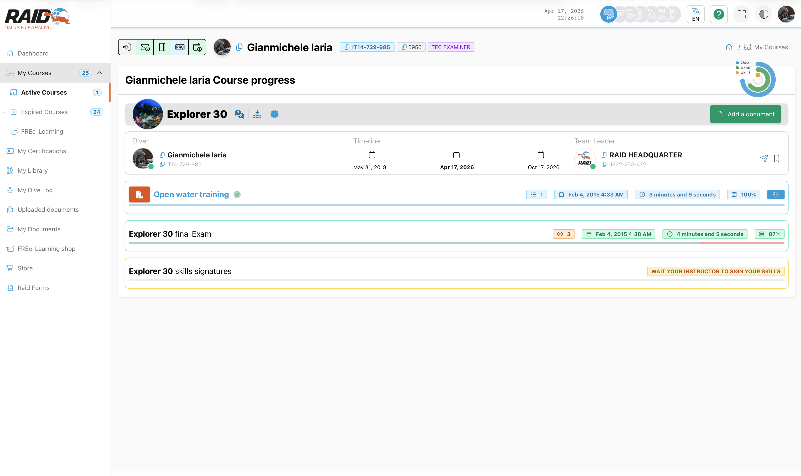
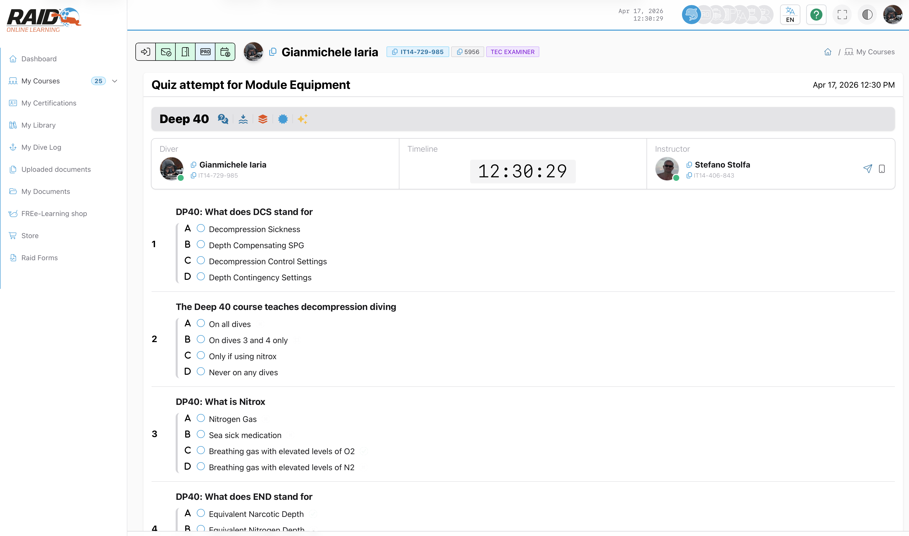
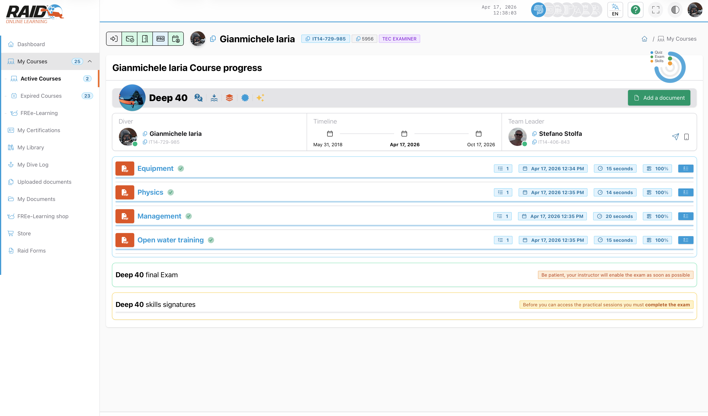
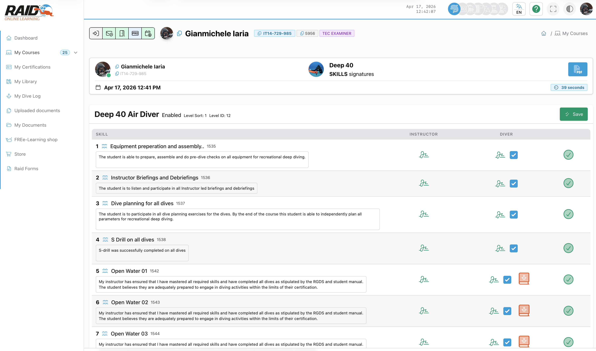
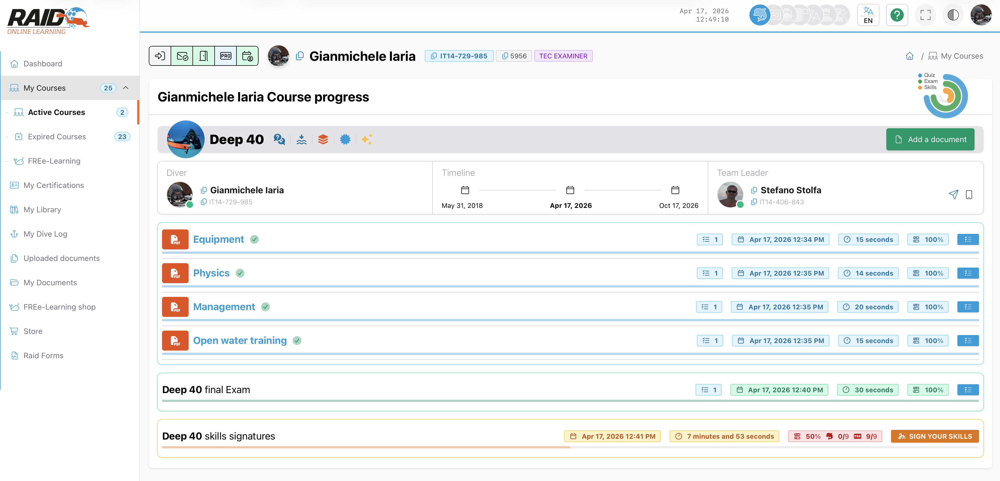

# Diver: moje kursy

## Screenshot





## Gdzie znalezc

Menu: **Diver -> Moje kursy**

## Co mozesz zrobic

- Przegladac aktywne i wygasle kursy.
- Otwierac postep kursu.
- Kontynuowac module/quizzes, exam i skills (jesli dostepne dla kursu).

## Lista kursow

Typowe kroki:

1. Otworz liste kursow.
2. Wybierz kurs, aby otworzyc postep.
3. Jesli kursu brakuje, sprawdz tez sekcje wygasle (jesli jest).

## Postep kursu (podsumowanie)

Po otwarciu kursu przechodzisz do strony **postepu**. To centrum kursu: co zostalo ukonczone i jaki jest nastepny krok.

<!-- TODO(screenshot): docs/assets/screenshots/diver/pl/courses-progress.png -->


Typowe kroki:

1. W kursie znajdz nastepny krok (module, quiz, exam, skills).
2. Wykonaj go i wroc do podsumowania postepu.

## Proby (quiz/exam/skills)

Proby to strony, na ktorych **wykonujesz** aktywnosc (odpowiadasz, wysylasz, potwierdzasz).

### Proba quizu (modul)

<!-- TODO(screenshot): docs/assets/screenshots/diver/pl/courses-quiz-attempt.png -->


Typowe kroki:

1. Z podsumowania postepu otworz nastepny krok (modul/quiz).
2. Odpowiedz na pytania.
3. Wyslij.
4. Otworz wyniki (jesli dostepne), aby sprawdzic odpowiedzi.

### Proba egzaminu

<!-- TODO(screenshot): docs/assets/screenshots/diver/pl/courses-exam-attempt.png -->


Uwaga: egzamin jest dostepny dopiero po ukonczeniu wymaganych quizow/modulow oraz po aktywacji przez instruktora.

Typowe kroki:

1. Z podsumowania postepu otworz **Exam**.
2. Ukoncz egzamin.
3. Wyslij i poczekaj na strone z wynikami.

### Skills

Skills to praktyczne kroki, ktore moga wymagac potwierdzenia zaleznie od konfiguracji kursu.

<!-- TODO(screenshot): docs/assets/screenshots/diver/pl/courses-skills.png -->


Uwaga: mozesz potwierdzic skills dopiero po tym, jak instruktor oznaczy je jako ukonczone.

Wskazowka: jesli kurs tego wymaga, pamietaj o uzupelnieniu wpisu Dive Log/Logbook dla skills przed potwierdzeniem.

## Szczegoly postepu (quiz/exam/skills)

Szczegoly postepu to strony, na ktorych przegladasz **wyniki** (np. odpowiedzi quizu lub wyniki egzaminu).

<!-- TODO(screenshot): docs/assets/screenshots/diver/pl/courses-results.png -->


## Typowe problemy

- Przekierowanie do logowania: sesja wygasla.
- Brak dostepu: email nie zweryfikowany.
- Nie znaleziono kursu: stary link lub kurs nie jest powiazany z uzytkownikiem.

<details>
<summary>Dla wsparcia (szczegoly techniczne)</summary>

Lista kursow:

```text
GET https://user.diveraid.com/pl/diver/courses
GET https://user.diveraid.com/pl/diver/courses/expired
```

Postep i proby:

```text
GET https://user.diveraid.com/pl/diver/courses/progress/{log_code}
GET https://user.diveraid.com/pl/diver/courses/progress/{log_code}/module/{module}
GET https://user.diveraid.com/pl/diver/courses/progress/{log_code}/exam
GET https://user.diveraid.com/pl/diver/courses/progress/{log_code}/skills
GET https://user.diveraid.com/pl/diver/courses/progress/{log_code}/quiz/{quiz}
GET https://user.diveraid.com/pl/diver/courses/progress/{log_code}/exam/{exam}
GET https://user.diveraid.com/pl/diver/courses/progress/{log_code}/skill
GET https://user.diveraid.com/pl/diver/courses/progress/{log_code}/skill/sign
```

</details>

Dalej: [FREE-Learning shop](free-learnings.md)

