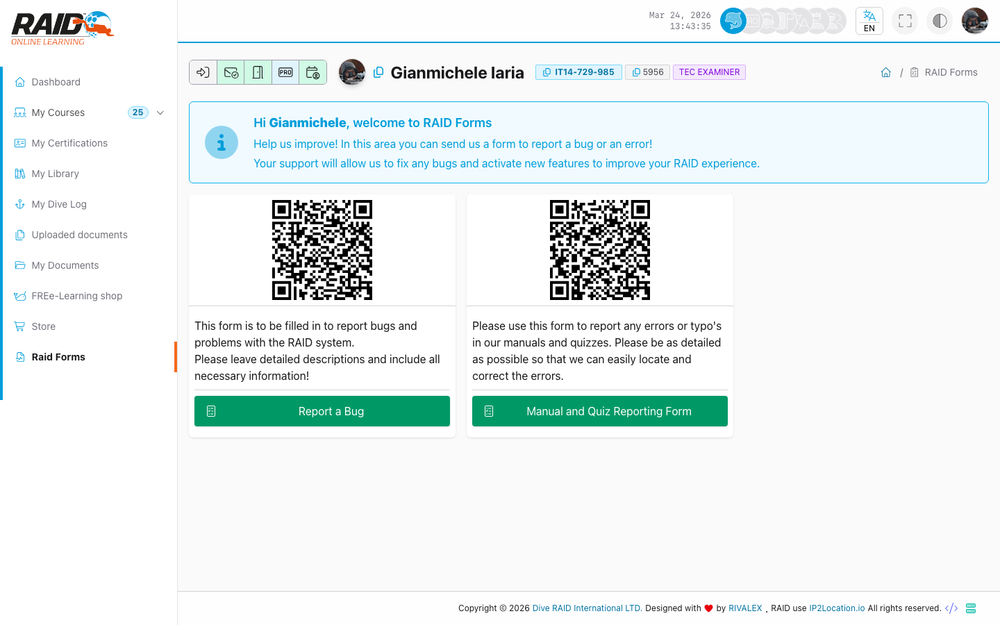

# Diver: formularze RAID

## Gdzie znalezc

Menu: **Formularze RAID**

## Lista formularzy

Ta strona pokazuje dostepne formularze.



Typowe kroki:

1. Otworz liste formularzy.
2. Wybierz formularz, aby go zobaczyc lub wypelnic (w zaleznosci od typu).

## Typowe problemy

- Formularz niedostepny: moze byc ograniczony do kursu lub konkretnej roli.

<details>
<summary>Dla wsparcia (szczegoly techniczne)</summary>

```text
GET https://user.diveraid.com/pl/diver/forms/
```

</details>

