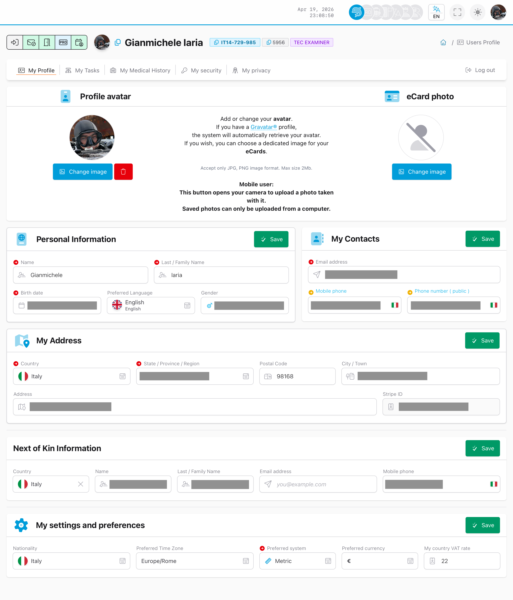

# Meu Perfil

## Objetivo

Os seus dados pessoais e informacao da conta.

## Onde encontrar

Menu da foto de perfil -> **Meu Perfil**



## Acoes tipicas

- Rever os seus dados.
- Atualizar os campos editaveis.

<details>
<summary>Para suporte (detalhes tecnicos)</summary>

```text
GET https://user.diveraid.com/pt/user/profile
```

</details>

Seguinte: [Minhas Tarefas](my-tasks.md)
