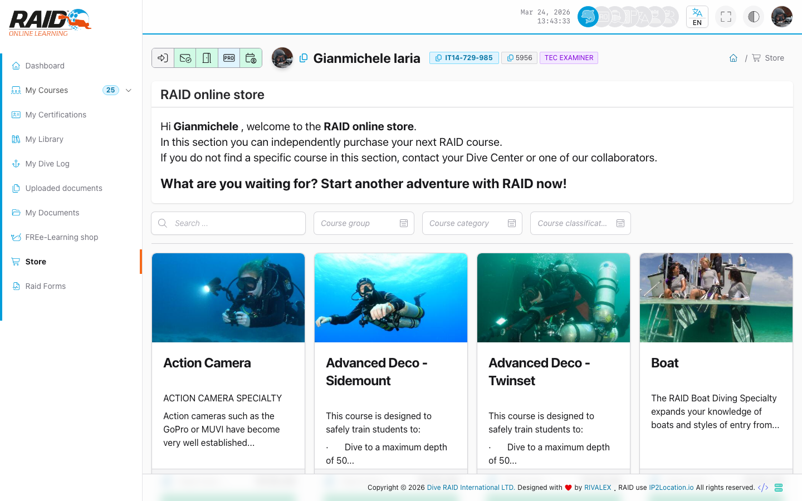

# 潜水员：线上商店

潜水员商店通常用于购买课程。

## 在哪里找到

菜单：**潜水员 -> 线上商店**

## 商店首页

典型操作：

1. 打开商店。
2. 选择一个课程。
3. 进入结账（checkout）。



## 结账与下单

典型操作：

1. 在结账页面确认订单。
2. 等待结果页面。

## 支付结果

## 常见问题

- 结果为 `fail`：重试或检查支付方式。
- 无法进入结账：课程不可用，或你的资料不允许购买。

<details>
<summary>技术支持（技术细节）</summary>

```text
GET https://user.diveraid.com/zh/diver/store
GET https://user.diveraid.com/zh/diver/store/course/{course}/checkout
GET https://user.diveraid.com/zh/diver/store/course/{course}/order
GET https://user.diveraid.com/zh/diver/store/course/success
GET https://user.diveraid.com/zh/diver/store/course/fail
```

</details>

下一步：[表格工具](forms.md)

