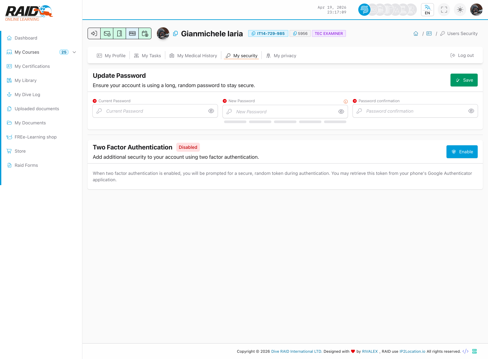

# 我的安全设置

## 用途

安全相关设置（例如密码、两步验证、会话）。

## 在哪里

头像菜单 -> **我的安全设置**



<details>
<summary>支持（技术细节）</summary>

```text
GET https://user.diveraid.com/zh/user/profile/security
```

</details>

下一步： [我的个人隐私](my-privacy.md)
